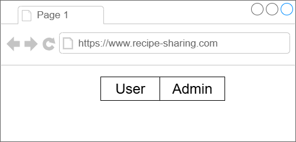
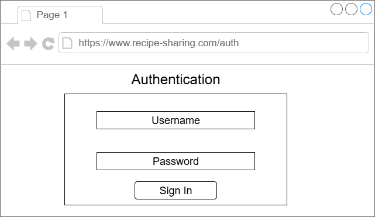

# A Serverless Web Application

## Project overview
In this project, we will work on an application for sharing recipes, where a user can create, delete, or
read their recipes. We will implement this by utilising serverless serivces provides by AWS to handle out bakend instead of managing servers to deploy our web app.

## Functional Requirements
Our application should serve two different profiles: admins and end users.
 - Platform admin: The platform owner, who are responsible for creating a new recipe, maintain it, or even delete it.
 - End users/consumers: The end user, who uses the platform for accessing recipes and like the preferred ones.
 - Our user interface should be simple and responsive.
 - Users should be able to authenticate to use the application.

 We will start with two different pages, **/users** for the end users and **/admin** for admins, to support the two differnt personas.
 
  

  Exploring each profile.

  **/user**
  
  - Access the list of recipe titles
  - Ability to choose a specific recipe and access all the details.
  - Ability to like a specific recipe.
  - Responsive.
  
  

  **/admin**

- Must be able to authenticate and authorized.
- Access the list of recipe titles.
- Ability to delete recipes.
- Support recipe creation.
- Control the maximum amount of ingredients, steps, and recipes supported
- Responsive.

