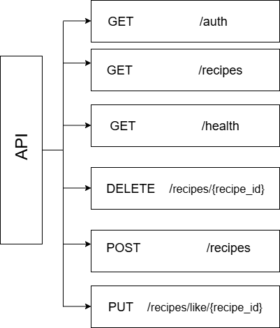

# A Serverless Web Application

## Project overview
In this project, we will work on an application for sharing recipes, where a user can create, delete, or
read their recipes. We will implement this by utilising serverless serivces provides by AWS to handle out bakend instead of managing servers to deploy our web app.

## Functional Requirements
Our application should serve two different profiles: admins and end users.
 - Platform admin: The platform owner, who are responsible for creating a new recipe, maintain it, or even delete it.
 - End users/consumers: The end user, who uses the platform for accessing recipes and like the preferred ones.
 - Our user interface should be simple and responsive.
 - Users should be able to authenticate to use the application.

 We will start with two different pages, **/users** for the end users and **/admin** for admins, to support the two differnt personas.
 
  

  Exploring each profile.

  **/user**
  
  - Access the list of recipe titles
  - Ability to choose a specific recipe and access all the details.
  - Ability to like a specific recipe.
  - Responsive.
  
  

  **/admin**

- Must be able to authenticate and authorized.
- Access the list of recipe titles.
- Ability to delete recipes.
- Support recipe creation.
- Control the maximum amount of ingredients, steps, and recipes supported
- Responsive.

## Non-functional requirements

- Global distribution to serve users spread across the globe.
- Event-driven architecture
- Cost-effectiveness.
- Low infrastructure management.

## Technical requirements

- Modern frontend framework - React.js
- Solely use serverless technologies eg. Lambda.
- Backend programming language - Python

## Data requirements

Operations to implement are the following:

- **List the recipes**: Present a list of the recipes created.
- **Delete a recipe**: If an admin no longer wants a speccific recipe to be part of the portfolio, it should be possible to delete the item.
- **Create a recipe**: Create a new recipe to share with the users.
- **Like a recipe**: record the number of likes in a specific recipe.

We will use the following document to store our data

recipe_example.json:
<pre>
{
    "ID": "GUID",
    "Title": "recipe title",
    "Ingredients": [...],
    "Steps": [...],
    "Likes": X
}
</pre>

## Architecture

Our architecture will follow a three well-defined layers.

- **Presentation Layer**: Hosting and serving the frontend.
- **Compute Layer**: Executing business logic
- **Data Layer**: Storing and retrieving data.

An API is used as the mode of communication between the Presentation and Compute Layers. The API is responsibe for exposing the endpoints to perform all the actions to execute and abstract the business logic. 

### API structure
The data operaions we need include the following:
- **GET /recipes**: This gets the list of recipes.
- **GET /healh**: This is a simple health check endpoint.
- **DELETE /recipes{recipe_id}**: This deletes a specific recipe with a defined ID.
- **POST /recipes**: This creates a new recipe record.

